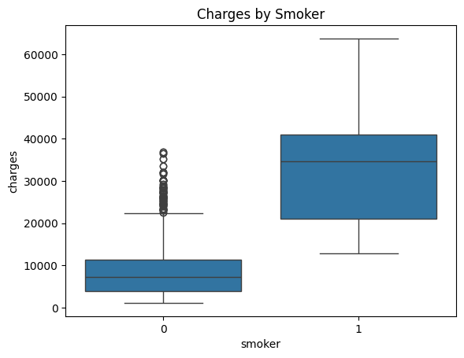
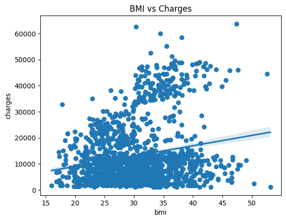
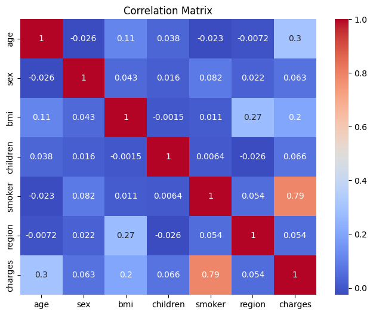

# Insurance Cost Analysis

This project analyzes a medical insurance dataset to understand the factors influencing insurance charges and build predictive models.

It demonstrates a complete machine learning workflow, including data cleaning, exploratory data analysis (EDA), model development, and model refinement.

---

## Objectives

- Clean and prepare a real-world dataset  
- Perform exploratory data analysis (EDA)  
- Identify key drivers of insurance charges  
- Build regression models to predict costs  
- Evaluate and refine model performance  

---

## Key Insights

- **Smoking status is the strongest predictor of insurance charges**  
  Smokers incur significantly higher medical costs compared to non-smokers.

- **Age has a moderate positive relationship with charges**  
  Older individuals tend to have higher insurance expenses.

- **BMI shows a weak to moderate relationship**  
  Higher BMI is associated with increased charges, but is less influential than smoking.

- **Children and region have minimal impact**  
  These variables show very low correlation with charges and are not strong predictors.

---

## Charges by Smoker

This visualization highlights the significant difference in insurance charges between smokers and non-smokers.

---

## BMI vs Charges

This plot shows a weak positive relationship between BMI and insurance charges.

---

## Correlation Matrix

The heatmap illustrates relationships between variables, confirming that smoking status has the strongest correlation with charges.

---

## Model Performance

- **Simple Linear Regression (BMI only)**  
  R² ≈ 0.04 → Poor predictive performance  

- **Multiple Linear Regression**  
  R² ≈ 0.75 → Significant improvement using multiple features  

- **Ridge Regression**  
  Reduced overfitting and improved generalization  

- **Polynomial Regression**  
  Best performance with R² ≈ 0.80 on test data  

---

## Model Insights

- Using a single feature (BMI) is insufficient for accurate predictions  
- Combining features significantly improves model performance  
- Regularization helps prevent overfitting  
- Non-linear relationships improve predictive accuracy  

---

## Conclusion

Insurance charges are influenced by multiple factors, with smoking status being the most significant.

While more complex models can improve accuracy, evaluating performance on test data is essential to ensure the model generalizes well and avoids overfitting.

---

## Tools

- Python  
- Pandas  
- Scikit-learn  
- Seaborn  
- Matplotlib  
